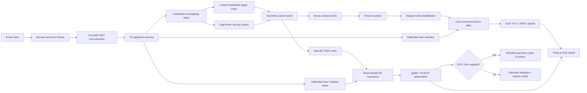

# AeroRecon AI

Experimental, local-first reconstruction of a 3D scene from drone video.

AeroRecon extracts camera motion from video, reconstructs overlapping views with CUDA multi-view stereo, refines a mesh with Open3D, and trains 3D Gaussian appearance with gsplat/PyTorch. The browser can switch between the mesh, Gaussian preview, dense points, and camera path.

> [!WARNING]
> AeroRecon is a research prototype. Its current output is **not survey-grade, metrically calibrated, georeferenced, or independently validated**. Do not use it for engineering measurements, navigation, boundaries, construction, inspection, safety decisions, or legal land records.

## Current state

The current primary path uses content-aware keyframes sampled across the complete video, COLMAP sparse camera recovery, CUDA PatchMatch stereo, geometric depth fusion, SegFormer sky masks, Poisson meshing, and calibrated multi-view texture projection. See [the full codebase audit](docs/CODEBASE_AUDIT.md) for an evidence-based description of what is real, approximate, missing, and planned.

The end-to-end workflow runs on the supplied 28.72-second, 1920×1080, 25 FPS field video and processes all 718 decoded frames.

| Capability | State | What it means |
| --- | --- | --- |
| Local upload and project UI | Working | Upload, process, inspect, orbit, select layers, and download artifacts locally. |
| Classical camera reconstruction | Working with assumptions | COLMAP/PyCOLMAP registered 75/75 selected views from the full clip. Intrinsics are assumed rather than independently calibrated. |
| Dense multi-view stereo | Working | CUDA PatchMatch and geometric consistency create observed depth and a dense colored point cloud. |
| Open3D TSDF refinement | Working | Calibrated depth maps and RGB views fuse into a smoother surface; small fragments and non-manifold edges are removed. |
| 3D Gaussian Splatting | Working | An Open3D surface initializes Gaussian centers; gsplat/PyTorch optimizes position, covariance, opacity, and color against calibrated non-sky frames. Held-out frames measure image fit. |
| Semantic sky masking | Working with model limitations | SegFormer masks sky before stereo fusion so moving clouds do not become false geometry. |
| Camera-projected mesh texture | Working with gaps | COLMAP selects calibrated source views per visible face, corrects color, and bakes a real-image atlas. |
| Per-frame camera tracking | Working experimentally | Optical flow and PnP track the remaining 664 frames; this sample used zero interpolated poses. |
| Monocular depth | Working experimentally | MoGe-2 Base predicts depth/validity for every frame. Sparse features align relative scale. |
| Semantic understanding | Working with errors | SegFormer identifies sky, field, buildings, and vegetation, but was trained for general scenes and misclassifies this aerial domain. |
| Full-video fusion | Working experimentally | Open3D TSDF integrates valid depth from every frame. |
| Flat-field orientation | Working as a scene prior | A shared ground plane fixes the false-mountain failure for this agricultural clip. It must be disabled for real hills or mountains. |
| Houses and trees | Prototype | Compact semantic clusters become closed procedural solids. Their placement is evidence-based; their shape and hidden sides are inferred. |
| Texture | Prototype | A 1024×1024 UV atlas uses registered video views. Unobserved and weakly aligned regions remain coarse or filled. |
| Metric scale | Ready when telemetry is supplied | A 3D similarity fit converts relative model coordinates to metres from matched per-frame GPS. |
| GPS/IMU alignment | Implemented; awaiting data | CSV ingestion fits a WGS84 local ENU frame, validates residuals, and transforms both mesh and Gaussian covariance. The supplied MP4 contains no telemetry. |
| Real-world accuracy validation | Not completed | Internal consistency numbers are available; no LiDAR, RTK, surveyed distance, or withheld real-scene ground truth has been used. |

## Latest dense photogrammetry result

The latest accepted run is `outputs/drone-photogrammetry-dense` (generated artifacts are ignored by Git).

| Measurement | Result |
| --- | ---: |
| Video coverage | 0.00–28.44 seconds |
| Registered keyframes | 75 / 75 |
| Sparse reprojection error | 1.04 px |
| Geometrically fused non-sky points | 486,360 |
| Semantic sky masks | 75 |
| Mean masked sky area | 47.2% |
| Browser mesh vertices | 173,378 |
| Browser mesh triangles | 169,802 |
| Faces assigned to calibrated views | 120,306 |
| Texture atlas | 4096×2966 |
| Output scale | Relative |

The reprojection error measures how well sparse features fit the recovered cameras. It is an internal consistency check, **not an independent ground-accuracy measurement**. Uniform crops, distant objects, occluded sides, and surfaces seen with little camera translation can remain incomplete.

### Open3D refinement

The `outputs/drone-open3d-tsdf-v2` comparison run fuses the same 75 calibrated depth maps and semantic sky masks into an Open3D scalable TSDF volume.

| Measurement | Result |
| --- | ---: |
| Calibrated depth views fused | 75 / 75 |
| Non-sky depth samples integrated | 16,474,618 |
| Raw TSDF triangles | 1,324,455 |
| Small-component triangles removed | 246,112 |
| Final vertices | 155,457 |
| Final triangles | 249,999 |

The Open3D output uses observed RGB vertex colors. It is smoother and smaller than the Poisson comparison mesh, but it cannot recover surfaces that the video did not observe with enough parallax.

## What happened during development

1. The first classical reconstruction registered only part of the video and recovered suspicious camera intrinsics.
2. A fixed-intrinsics COLMAP run registered 54 stable keyframes, but the scale and lens model remained assumptions.
3. Early single-frame AI surfaces produced one depth sheet rather than a full map.
4. Full-video depth fusion was added so every decoded frame contributes.
5. Per-frame optical-flow/PnP tracking replaced interpolation between most keyframes: 54 anchors + 664 tracked frames.
6. MoGe-2 replaced the earlier single-view surface as the main depth engine. SegFormer added sky/ground/building/vegetation labels.
7. Sparse-track scale alignment and held-out depth refinement were added per frame.
8. The real clip incorrectly formed mountains. A field-specific plane model now estimates local ground and maps it onto one shared Y=0 plane.
9. Building and tree pixels initially became stretched sheets. Compact clusters now become closed wall/roof and trunk/canopy solids.
10. The browser had a legacy Y-axis inversion. Ground-aligned output now displays +Y upward.
11. Vertex colors were insufficient for realistic appearance. The current exporter creates UVs and embeds a photographic atlas assembled from registered video views.
12. Texture trials showed that tracked poses can be adequate for geometry but still smear photographs. The current atlas therefore uses the 54 bundle-adjusted anchors and verified ground pixels; weakly observed regions remain limited.

## Pipeline



### Main components

- `pipeline/cli.py` — video validation, keyframe extraction, COLMAP feature extraction/matching/mapping, run manifests, and sparse exports.
- `pipeline/dense_mvs.py` — CUDA PatchMatch, SegFormer sky masks, geometric fusion, Poisson mesh, calibrated multi-view texture, GLB, and browser export.
- `pipeline/open3d_refine.py` — calibrated RGBD integration, scalable TSDF extraction, component cleanup, Taubin smoothing, decimation, and colored GLB/browser export.
- `pipeline/gaussian_splat.py` — calibrated sky-masked dataset export, Open3D mesh initialization, training orchestration, reports, and telemetry template.
- `pipeline/gsplat_train.py` — CUDA Gaussian rasterization and PyTorch optimization with held-out PSNR validation and standard Gaussian PLY export.
- `pipeline/georeference.py` — per-image GPS matching, WGS84 ECEF/local ENU conversion, similarity fitting, residual validation, and metric mesh/Gaussian export.
- `pipeline/pose_tracking.py` — dense frame trajectory using optical flow, 3D feature tracks, robust PnP, and registered anchors.
- `pipeline/semantic_fusion.py` — main experimental pipeline: MoGe-2, SegFormer, sparse scale alignment, depth refinement, field leveling, TSDF fusion, object solidification, and exports.
- `pipeline/object_models.py` — connected semantic clusters, procedural houses/trees, closed meshes, and video-color transfer.
- `pipeline/texture_atlas.py` — top-down atlas rasterization, UV generation, gap filling, and object-footprint painting.
- `pipeline/train_aerial_corrector.py` — small residual depth corrector trained with frozen MoGe-2 predictions.
- `pipeline/ai_reconstruct.py` — optional Depth Anything 3 multi-view preview retained for comparison.
- `pipeline/video_fusion.py` — earlier DA3/Open3D fusion experiment retained for comparison.
- `pipeline/server.py` — loopback-only FastAPI worker API and artifact server.
- `apps/web/` — dependency-local Three.js reconstruction interface.
- `tests/` — camera, geometry, depth gating, object, texture, server, and pipeline tests.

## Models and libraries

Model weights are intentionally excluded from Git.

| Component | Current use | License note |
| --- | --- | --- |
| [MoGe-2 Base Normal](https://huggingface.co/Ruicheng/moge-2-vitb-normal) | Per-frame depth, validity, and geometry | MIT model repository |
| [SegFormer B0 ADE20K](https://huggingface.co/nvidia/segformer-b0-finetuned-ade-512-512) | General semantic segmentation | Model card reports `other`; review NVIDIA/ADE20K terms before commercial use |
| [Depth Anything 3 Small](https://huggingface.co/depth-anything/DA3-SMALL) | Optional comparison preview | Apache-2.0 code; review model-card terms |
| COLMAP / PyCOLMAP | Sparse cameras, dense PatchMatch stereo, fusion, meshing, simplification, and texture projection | BSD-3-Clause |
| Open3D | TSDF fusion and mesh processing | MIT |
| [gsplat](https://docs.gsplat.studio/) | Differentiable CUDA Gaussian rasterization | Apache-2.0 |
| OpenCV | Optical flow, PnP, and image processing | Apache-2.0 |
| Trimesh | Object construction and GLB export | MIT |
| Three.js | Local interactive viewer | MIT |
| [GaussianSplats3D](https://github.com/mkkellogg/GaussianSplats3D) | Depth-sorted browser rendering of Gaussian PLY files | MIT |

The project also uses NumPy, SciPy, PyTorch, Transformers, Pillow, PyAV, FastAPI, Uvicorn, and psutil. Review all upstream licenses and the licenses of any datasets or weights before redistribution or commercial use.

## Requirements

The tested development machine used Windows 11, Python 3.11, an NVIDIA RTX 4060 Laptop GPU with 8 GB VRAM, CUDA-enabled PyTorch, a CUDA-enabled COLMAP build, FFmpeg on `PATH`, and Git. The supplied dense run took about 26 minutes at a 1200-pixel maximum image dimension; timing varies.

## Installation

### 1. Clone and create the classical/web environment

```powershell
git clone https://github.com/Prithibi17/aerorecon.git
cd aerorecon
py -3.11 -m venv .venv
.\.venv\Scripts\python.exe -m pip install --upgrade pip
.\.venv\Scripts\python.exe -m pip install -e . pytest httpx
```

### 2. Create the AI environment

Install a CUDA build of PyTorch compatible with the installed NVIDIA driver, then install the AI packages and upstream model code:

```powershell
py -3.11 -m venv .venv-ai
.\.venv-ai\Scripts\python.exe -m pip install --upgrade pip
# Choose the correct CUDA command from https://pytorch.org/get-started/locally/
.\.venv-ai\Scripts\python.exe -m pip install torch torchvision
.\.venv-ai\Scripts\python.exe -m pip install -r requirements-ai.txt

git clone --depth 1 https://github.com/microsoft/MoGe.git third_party/MoGe
git clone --depth 1 https://github.com/ByteDance-Seed/Depth-Anything-3.git third_party/Depth-Anything-3
.\.venv-ai\Scripts\python.exe -m pip install -e third_party/MoGe
.\.venv-ai\Scripts\python.exe -m pip install -e third_party/Depth-Anything-3
```

`requirements-lock.txt` records the tested classical environment. `requirements-ai-lock.txt` is a snapshot of the development AI environment and includes local editable paths, so it is evidence rather than a portable installer.

### 3. Download model weights

```powershell
.\.venv-ai\Scripts\python.exe scripts\download_models.py
```

The script downloads MoGe-2 Base Normal to `models/MoGe-2-Base`, SegFormer B0 ADE20K to `models/SegFormer-B0`, and DA3 Small to `models/DA3-SMALL`. These large downloads stay outside Git.

### 4. Install a CUDA-enabled COLMAP build

Download the official Windows CUDA archive from the [COLMAP releases page](https://github.com/colmap/colmap/releases), extract it under `third_party/colmap-4.0.4-cuda`, and verify:

```powershell
.\third_party\colmap-4.0.4-cuda\bin\colmap.exe -h
```

The dense command defaults to this ignored local path. Override it with `--colmap` when COLMAP is installed elsewhere.

### 5. Build a dense map from a completed sparse run

```powershell
.\.venv-ai\Scripts\python.exe -m pipeline.dense_mvs outputs\YOUR_SPARSE_RUN `
  --out outputs\YOUR_DENSE_RUN `
  --ground-transform outputs\YOUR_GROUND_RUN\ground_transform.json
```

The SegFormer model is used only to remove sky from stereo fusion. The geometry comes from agreement across calibrated video views; it does not synthesize house or tree shapes.

### 6. Refine the dense depth maps with Open3D

```powershell
.\.venv-ai\Scripts\python.exe -m pipeline.open3d_refine outputs\YOUR_DENSE_RUN `
  --out outputs\YOUR_OPEN3D_RUN `
  --ground-transform outputs\YOUR_GROUND_RUN\ground_transform.json
```

The default 0.015 voxel length and three Taubin smoothing iterations were tested on the supplied clip. Smaller voxels preserve more detail but increase memory use and noise.

### 7. Train 3D Gaussian Splatting appearance

The official Windows gsplat wheel currently requires a separate Python 3.10 / PyTorch 2.4 / CUDA 12.4 environment:

```powershell
uv venv --python 3.10 .venv-gsplat
uv pip install --python .venv-gsplat\Scripts\python.exe torch==2.4.1 torchvision==0.19.1 --index-url https://download.pytorch.org/whl/cu124
uv pip install --python .venv-gsplat\Scripts\python.exe `
  "https://github.com/nerfstudio-project/gsplat/releases/download/v1.5.3/gsplat-1.5.3%2Bpt24cu124-cp310-cp310-win_amd64.whl" `
  plyfile packaging setuptools

.\.venv-ai\Scripts\python.exe -m pipeline.gaussian_splat outputs\YOUR_DENSE_RUN `
  --mesh-run outputs\YOUR_OPEN3D_RUN --out outputs\YOUR_GSPLAT_RUN
```

Every eighth calibrated view is excluded from optimization and used for validation. `validation_renders/` puts each withheld video frame beside the Gaussian render.

### Optional: ground cleanup and inferred object backs

```powershell
.\.venv-ai\Scripts\python.exe -m pipeline.complete_scene --out outputs\completed-scene
```

The defaults use the example video's dense MVS, Open3D mesh, and calibrated camera dataset. For another video supply `--source`, `--dense`, and `--cameras` with matching runs. SegFormer labels are accepted only where camera depth agrees with the mesh. Multi-view sky votes, unsupported vertices, below-ground artifacts, and long stretched faces are rejected. A rigid ground fit uses observed semantic ground. Its support is reported; low support means alignment remains uncertain.

Compact building and vegetation clusters receive convex closed backs down to the ground; these are approximate envelopes, not detailed generated architecture or foliage. Ground gaps are filled only near observed ground samples. A per-triangle texture atlas projects calibrated video onto observed faces, while inferred faces receive interpolated colours from the same object. Unseen photographic details are not recovered. The viewer's **Inferred backs + ground gaps** toggle separates these additions from observed geometry. The combined GLB includes both layers.

Gaussian training now explicitly penalizes opacity on semantic sky, bounds Gaussian sizes, and regularizes motion away from the source mesh. Previously trained checkpoints are unchanged; these training corrections apply to new runs. Completion output is a mesh and does not require Gaussian training.

The completion cleanup dilates semantic sky with a 17-pixel kernel in the 640-pixel training views and requires five depth-supporting views. This can remove legitimate distant silhouettes as well as horizon artifacts. Steep triangles labelled as ground are excluded to suppress ground-depth walls. Ground completion preserves the footprint of supported ground below the uncertain fitted plane and adds planar patches where at least three camera views label ground. Those patches use nearby ground colours, avoiding stretched video projections on an uncertain plane. They are inferred, not measured terrain. Photographic texture patches reject sky across their triangular interiors; the viewer disables atlas mipmaps to prevent neighbouring triangle patches bleeding together at a distance.

### 8. Georeference with GPS and IMU telemetry

Fill the generated `telemetry_template.csv`. Image names must match the reconstruction and at least three non-collinear camera positions need latitude, longitude, and altitude. Yaw, pitch, and roll are preserved as telemetry evidence; positional alignment is solved from GPS camera centers.

```powershell
.\.venv-ai\Scripts\python.exe -m pipeline.georeference outputs\YOUR_GSPLAT_RUN `
  --telemetry outputs\YOUR_GSPLAT_RUN\telemetry_template.csv `
  --out outputs\YOUR_GEOREFERENCED_RUN
```

The result uses metres in a WGS84 local east/north/up frame anchored at one recorded camera. `georeference.json` records the anchor, transform, scale, and GPS residuals. The command rejects weak geometry or a median alignment error above 10 m by default.

## Run the application

Double-click `Start-AeroRecon.cmd` or run:

```powershell
.\.venv\Scripts\python.exe -m uvicorn pipeline.server:app --host 127.0.0.1 --port 8765
```

Open <http://127.0.0.1:8765>. Use **New reconstruction** to upload an MP4, MOV, M4V, AVI, or MKV file up to 1 GB. When the camera stage completes, select the run and use **Build full-video map**. After dense MVS and Open3D outputs exist for that video, **Train Gaussian map** launches the calibrated 2,000-step gsplat job from the interface.

The server binds to loopback and rejects cross-origin mutation requests. Uploaded videos and outputs remain in ignored local folders.

### Command-line workflow

```powershell
# Sparse camera reconstruction
.\.venv\Scripts\python.exe -m pipeline.cli run "C:\path\flight.mp4" --out outputs\flight-camera

# Full semantic map
.\.venv-ai\Scripts\python.exe -m pipeline.semantic_fusion outputs\flight-camera `
  --out outputs\flight-map --resolution 336 --flat-field --solid-objects
```

Use `--no-flat-field` for terrain that is not expected to be planar. Never enable the field constraint merely to make an incorrect reconstruction look flatter.

## Output files

| File | Purpose |
| --- | --- |
| `surface.glb` | Final textured triangle mesh with the atlas embedded. |
| `gaussians.ply` | Standard 3D Gaussian Splat with covariance, opacity, and color coefficients. |
| `gaussians.pt` | Trainable PyTorch parameters for continued optimization. |
| `telemetry_template.csv` | Per-image GPS/IMU input template for metric geographic alignment. |
| `validation_renders/` | Held-out video frames beside novel-view Gaussian renders. |
| `surface_full.ply` | Final surface in PLY form. |
| `dense.ply` | Colored point representation of final vertices. |
| `texture.png` | Generated texture atlas. |
| `surface_viewer.json` | Browser mesh positions, colors, semantic colors, indices, UVs, and texture reference. |
| `viewer.json` | Display point cloud, camera centers, coordinate flags, and counts. |
| `camera_centres.csv` | Per-frame relative camera positions. |
| `frames.csv` | Per-frame time, masks, depth scale, refinement decisions, and residuals. |
| `metrics.json` | Machine-readable result statistics. |
| `REPORT.md` | Human-readable method, warnings, and measurements. |
| `run_manifest.json` | Input hash, configuration, status, warnings, and provenance. |
| `keyframes/` | Semantic evidence overlays. |
| `sparse/`, `database.db` | Inspectable COLMAP evidence for camera-stage runs. |

## Why the current map is inaccurate

1. **Camera calibration is assumed.** Incorrect focal length or distortion changes camera motion, depth scale, and object shape.
2. **The video is mostly forward-looking.** Houses and trees do not have complete side, rear, and roof coverage.
3. **No GPS, IMU, gimbal angles, RTK, or ground-control points were supplied.** The system cannot independently recover metric scale, geographic position, gravity, or north.
4. **Monocular depth is ambiguous.** MoGe-2 predicts plausible geometry from appearance; it does not measure distance.
5. **SegFormer is out of domain.** ADE20K is a general scene dataset, so small aerial houses, crops, vegetation, and horizon regions are confused.
6. **Pose errors accumulate.** PnP-tracked poses can fuse geometry acceptably while remaining too imprecise for seamless photography.
7. **The flat-field prior is scene-specific.** It fixes this field clip but would erase genuine terrain relief.
8. **Object geometry is procedural.** A building cluster becomes a box and roof; a tree cluster becomes a trunk and canopy.
9. **Texture coverage is incomplete.** Registered anchors align best, but unobserved regions remain coarse or filled.
10. **There is no independent real-world test set.** Internal residuals can improve while absolute geometry remains wrong.

More AI models alone will not resolve missing viewpoints or missing ground truth. Better capture, calibration, telemetry, and evaluation should precede larger-model training.

## How to improve and train it

See [TRAINING_AND_CAPTURE.md](TRAINING_AND_CAPTURE.md) for the existing residual-corrector experiment and capture checklist.

### Phase 1 — establish ground truth

Collect multiple independent sites and keep complete sites in only one of train, validation, or test. Retain original frames, exact camera/lens data, calibration, timestamps, GPS/RTK, IMU attitude, gimbal angle, altitude source, coordinate reference system, nadir and oblique views, surveyed control/check points, aligned LiDAR or independently verified meshes, semantic masks, building/tree instance IDs, measured object subsets, and licensing/privacy records.

Never train on an AeroRecon reconstruction and then report accuracy against that same reconstruction.

### Phase 2 — fix calibration and pose

1. Add a calibration profile for every drone/camera/lens.
2. Read and synchronize SRT/telemetry with exact frame timestamps.
3. Use GPS/IMU as priors and optimize cameras with bundle adjustment.
4. Detect rolling shutter and electronic stabilization.
5. Add loop closure and global pose-graph optimization.
6. Compare camera ATE/RPE against RTK/IMU before depth evaluation.

Texture and geometry cannot align reliably until camera calibration and pose are accurate.

### Phase 3 — aerial semantic fine-tuning

Fine-tune segmentation on aerial labels. Start with SegFormer B0 for a controlled baseline. Use class-balanced crops, hard negatives at roofs/roads/field edges/horizon, temporal consistency, separate building/tree instances, site-level splits, per-class IoU/F1, boundary F1, instance AP, and calibrated uncertainty.

Possible starting datasets: [UAVid](https://uavid.nl/), [ISPRS 2D Semantic Labeling](https://www.isprs.org/education/benchmarks/UrbanSemLab/2d-sem-label-vaihingen.aspx), and [SensatUrban](https://github.com/QingyongHu/SensatUrban). Verify scope and licensing; none exactly matches this rural forward-looking video.

### Phase 4 — depth and surface training

The current 0.21-million-parameter residual corrector keeps MoGe-2 frozen. It used 716 TartanAir training images and 84 images from a separate trajectory for validation. Best normalized-depth AbsRel changed from 0.1167 to 0.1020, a 12.6% relative improvement on one synthetic environment. This does not prove real-video improvement.

For real training:

1. Precompute base-model depth with fixed hashes.
2. Train on RGB, log depth, calibrated intrinsics, normals, and semantics.
3. Combine scale-invariant depth, normal, edge-aware, temporal reprojection, and multi-view losses.
4. Give independently measured depth more weight than synthetic or pseudo-label depth.
5. Validate on unseen sites, drones, seasons, altitudes, and lighting.
6. Promote only when real held-out geometry and dimensions improve without pose regressions.

Current experiment command:

```powershell
.\.venv-ai\Scripts\python.exe -m pipeline.train_aerial_corrector `
  --dataset data\training\tartanair\ArchVizTinyHouseDay\Data_easy\ArchVizTinyHouseDay\Data_easy `
  --cache data\training\cache --out models\Aerial-Depth-Corrector `
  --samples 800 --epochs 8 --batch 8
```

[TartanAir](https://tartanair.org/) is useful for synthetic depth, pose, segmentation, and optical flow, but synthetic results must remain separate from real-world accuracy claims.

### Phase 5 — replace procedural objects

Track individual building/tree instances across frames, fuse their silhouettes and depth separately, estimate roof/wall planes, optimize meshes against multi-view evidence, preserve uncertainty, and mark unseen surfaces. For vegetation, compare meshes with point-based or neural radiance representations rather than forcing every crown into a solid mesh.

### Phase 6 — calibrated texture reconstruction

Unwrap a non-overlapping UV atlas; rank views per triangle by visibility, angle, resolution, blur, and exposure; reject occlusion with the mesh; compensate exposure/white balance; optimize seams; label unseen texels; and evaluate held-out PSNR, SSIM, LPIPS, seam energy, and coverage.

### Phase 7 — independent evaluation

| Subsystem | Required metrics |
| --- | --- |
| Camera trajectory | Absolute Trajectory Error, Relative Pose Error, rotation error |
| Depth | AbsRel, RMSE, δ thresholds, normal angular error |
| Surface | Chamfer distance, thresholded F-score, completeness |
| Ground | plane-normal error, elevation RMSE, slope error |
| Buildings | footprint IoU, height MAE, roof accuracy, instance precision/recall |
| Trees | crown-center error, crown-diameter MAE, instance precision/recall |
| Texture | held-out PSNR/SSIM/LPIPS, seam score, observed coverage |
| Georeferencing | horizontal/vertical GCP and independent checkpoint RMSE |

The UI should fail closed below documented calibration/pose/depth thresholds and show spatial uncertainty rather than one project-wide number.

## Better capture protocol

1. Keep original camera files; disable digital zoom and post-stabilization.
2. Lock exposure, focus, white balance, resolution, and frame rate when possible.
3. Fly a nadir grid with 75–85% forward and 70–80% side overlap.
4. Add a slower 35–45° oblique cross-grid around buildings and trees.
5. Keep motion smooth, shutter speed high, and subjects static.
6. Revisit the start area for loop closure.
7. Preserve telemetry/SRT and exact timestamps.
8. Measure visible scale/control and reserve independent checkpoints.
9. Avoid sky-dominant footage, heavy compression, blur, abrupt rolling-shutter turns, reflective water, and moving vegetation where practical.

See OpenDroneMap's [flight planning guidance](https://docs.opendronemap.org/flying/).

## Tests

```powershell
# Classical/server suite
.\.venv\Scripts\python.exe -m pytest -q

# AI geometry suite
.\.venv-ai\Scripts\python.exe -m unittest `
  tests.test_object_models tests.test_depth_refinement tests.test_pose_tracking
```

Current classical/server result: 22 tests passed and 5 optional AI-environment tests were skipped. The Phase 1 synthetic end-to-end validation registered 24/24 cameras with 12,683 sparse points and 0.243 px mean reprojection error. The previously documented AI geometry suite passed 10 tests in the AI environment.

## Repository policy

Python environments, model weights, original/uploaded videos, datasets, caches, generated reconstructions, logs, and cloned upstream repositories remain local and are ignored. Do not commit videos, checkpoints, GPS tracks, control coordinates, or generated maps without explicit license, privacy, and size review.

## License status

No project license has been selected yet. Until one is added, copyright law reserves rights to the project source. Every model, dataset, library, and third-party repository keeps its own license and usage terms.
